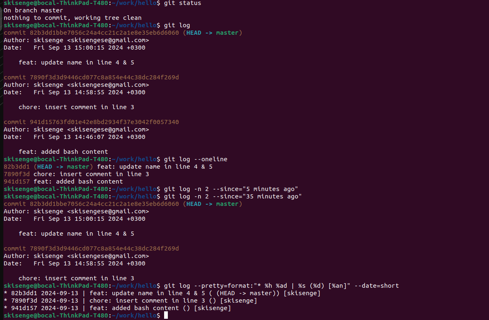

# _*History*_

## _*Show History*_

- To show the history of the working directory, run:

```bash
git log
```

### _*One-Line History*_

- To view a condensed one-line history showing only commit hashes and messages, run:

```bash
git log --oneline
```

### _*Customized Log Output*_

- To customize the log output, specify the number of entries or a time range. To display the last 2 entries, run:

```bash
git log -n 2
```

- To view the commits made within the last 5 minutes, run:

```bash
git log --since=5minutes
```

### _*Personalized Format*_

- To show logs in a personalized format, including the commit hash, date, message, branch information, and author name, run:

```bash
git log --pretty=format:"* %h %ad | %s (%d) [%an]" --date=short
```

- This will display the output in a format resembling:

```bash
* e4e3645 2023-06-10 | Added a comment (HEAD -> main) [John Doe]
```

- Note:
  - ``%h`` represents the commit hash
  - ``%as``  represents the date in the short format.
  - ``%ad`` represents the date in the long format.
  - ``%s`` represents the commit message
  - ``%d``  represents the abbreviated commit ref name (e.g. main)
  - ``%cr`` represents the commit message duration
  - ``%an``  represents the author name.

## Attached Display


