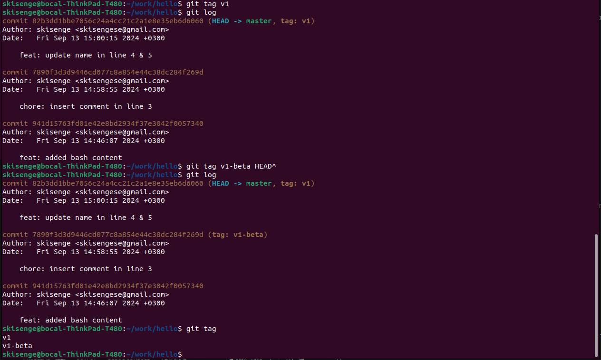

# _*Tagging*_

## _*Referencing Current Version**_

- To tag the current version of the repository as ``v1``, run:

```bash
git tag v1
```

- This will create a new tag v1 referencing the current commit.

## _*Tagging Previous Version*_

- To tag the version immediately prior to the current version as v1-beta, without relying on commit hashes to navigate through the history, run:

```bash
git tag v1-beta HEAD~1 (also HEAD^)
```

## _*Navigating Tagged Versions*_

- To move back and forth between the two tagged versions, v1 and v1-beta, use the following commands:
  - To switch to v1:

```bash
git checkout v1
```

- To switch to v1-beta:

```bash
git checkout v1-beta
```

## _*Listing Tags*_

- To display a list of all tags present in the repository to verify successful tagging, run:

```bash
git tag
```

- This will show a list of all tags in your repository, including v1 and v1-beta.
- And now if we `git log` we should be able to see this kind of an output.

## Tags Display


