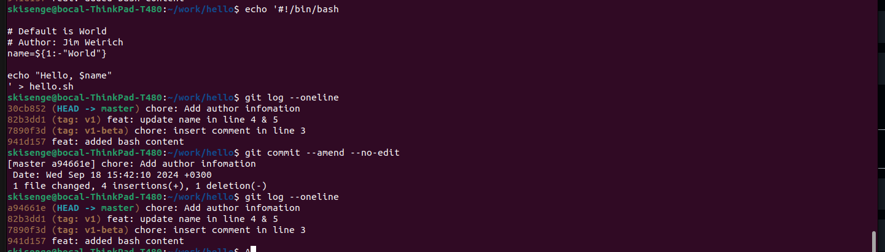

# _*Changed Your Mind?*_

## _*Reverting Changes*_

- Revert the changes back to their original state:-

```bash
# git checkout -- hello.sh
git restore hello.sh
```

- This will discard any local changes made to the file and restore it to its previous state.

## _*Staging and Cleaning*_

- Stage changes:

```bash
git add hello.sh
```

- Clean the staging area:

```bash
git restore --staged <filename>
# git reset HEAD <filename>
```

to discard the changes:

```bash
git restore <filename>
```

## _*Committing and Reverting*_

- Add the following unwanted changes again, stage the file, commit the changes, then revert them back to their original state, follow these steps:

```bash
git add hello.sh
git commit -m "Chore: commit unwanted changes to be reverted"
git revert HEAD^
```

## _*Tagging and Removing Commits*_

### _*Tagging the Latest Commit*_

- To tag the latest commit with ``oops``, run the following command:

```bash
git tag oops HEAD
```

### _*Removing Commits*_

- To remove commits made after the v1 version:

```bash
git reset --hard v1
```

### _*Ensuring HEAD Points to v1*_

- Verify that the HEAD now points to the commit with the tag v1 by running:

```bash
git log -1
```

## Tags display


### _*Displaying Logs with Deleted Commits*_

#### _*Showing Logs with Deleted Commits*_

- To display logs with deleted commits, including the one tagged as oops, run:

```bash
git log --graph --all
```

#### _*Cleaning Unreferenced Commits*_

- To ensure that unreferenced commits are deleted from history, use:

```bash
git prune
# git gc --prune=now
```

#### _*Author Information*_

- To add an author information to the file, open it in a text editor and add a line at the top:

```bash
#!/bin/bash

# Default is World
# Author: Jim Weirich
name=${1:-"World"}

echo "Hello, $name"

```

#### _*Adding the Author's email*_

- To do this without making a new commit!
- After making the changes on the file, we are going to do a special commit:

```bash
git commit --amend --no-edit
```

- This will update the commit message without changing the commit itself.



## **Note:**

### _**Key differences between git prune and git gc --prune=now:**_

**Pruning:** Both commands remove unreferenced objects, but `git prune` is more focused on this task, while `git gc` also performs other optimizations.

**Garbage collection:** `git gc` performs a more comprehensive cleanup of your repository, including repacking objects, which can improve performance.

**Timing:** ``git prune`` can be run independently, while `git gc` is typically part of a larger repository maintenance process.
